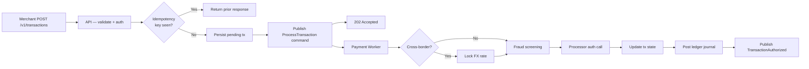
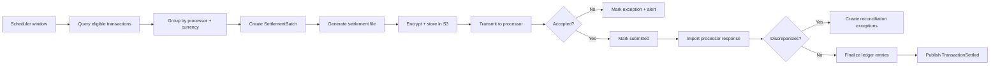

<div align="center">

# Payflow Engine

**High-volume financial transaction processing platform**

[](https://www.php.net/releases/8.4/)
[](https://laravel.com)
[](https://laravel.com/docs/octane)
[](https://kafka.apache.org)
[](https://clickhouse.com)
[](https://redis.io)
[](https://www.mysql.com)
[](https://phpunit.de)

*Handles the full payment lifecycle — merchant onboarding, transaction ingestion, authorization, double-entry ledger posting, capture/refund, webhook dispatch, and settlement batching.*

</div>

---

## Overview

Payflow Engine is a production-grade fintech backend built on Domain-Driven Design principles with a clean bounded-context module system. It separates transactional (OLTP) from analytical (OLAP) workloads, uses Kafka as a durable command/event backbone, and enforces financial correctness through double-entry bookkeeping and BCMath arithmetic throughout.

The platform is designed for horizontal scale: API, authorization workers, settlement workers, and analytics projection workers all run as independent process groups from a single coherent codebase.

---

## Architecture

```
┌─────────────────────────────────────────────────────────────────┐
│                    Payflow Engine Platform                       │
│                                                                  │
│  ┌──────────────┐   ┌──────────────────────────────────────┐    │
│  │  Laravel API  │   │           Laravel Workers            │    │
│  │  (Octane /    │   │  ┌────────────┐  ┌────────────────┐ │    │
│  │   Swoole)     │   │  │  Payment   │  │   Settlement   │ │    │
│  │               │   │  │  Worker    │  │   Worker       │ │    │
│  │  - AuthN/AuthZ│   │  └────────────┘  └────────────────┘ │    │
│  │  - Ingestion  │   │  ┌────────────┐  ┌────────────────┐ │    │
│  │  - Status     │   │  │  Analytics │  │   Webhook      │ │    │
│  │  - Webhooks   │   │  │  Projector │  │   Dispatcher   │ │    │
│  └──────┬───────┘   │  └────────────┘  └────────────────┘ │    │
│         │            └───────────────────────────────────── ┘    │
│         │                        │                               │
│    ─────┴────────────────────────┴──────                        │
│         │           Kafka / MSK                │                 │
│    ─────┬────────────────────────┬──────                        │
│         │                        │                               │
│  ┌──────▼──────┐   ┌─────────────▼──────┐  ┌────────────────┐  │
│  │ Aurora MySQL │   │    ClickHouse      │  │   Redis        │  │
│  │ (OLTP source │   │ (OLAP / analytics) │  │ (idempotency / │  │
│  │  of truth)   │   │                    │  │  locks / cache)│  │
│  └─────────────┘   └────────────────────┘  └────────────────┘  │
│                                                                  │
│                              S3  (settlement artifacts / reports)│
└─────────────────────────────────────────────────────────────────┘
```

### Data Flow: Transaction Authorization



### Data Flow: Settlement Batch



---

## Module Structure

The codebase is organised as vertical domain slices. Each module follows a strict `Domain → Application → Infrastructure → Interfaces` layering — no cross-module infrastructure sharing.

```
payflow-engine/
├── apps/
│   └── api/                        # Laravel 11 + Octane entrypoint
│       ├── src/                    # App bootstrapping, middleware, providers
│       ├── config/                 # Per-environment configuration
│       ├── database/               # Migrations (all tables)
│       ├── routes/                 # Route definitions (internal + merchant)
│       └── tests/                  # PHPUnit feature/integration + Behat
│
├── modules/
│   ├── Shared/                     # Value objects, contracts, base classes
│   ├── MerchantManagement/         # Merchant identity, credentials, webhooks
│   ├── PaymentProcessing/          # Transaction state machine, processor routing
│   ├── FXCrossBorder/              # FX rate locking, cross-border markup
│   ├── Ledger/                     # Double-entry bookkeeping, journal entries
│   ├── Settlement/                 # Batch generation, S3 artifacts, reconciliation
│   └── Audit/                      # Immutable audit log, event deduplication
│
└── platform/
    └── docker-compose.yml          # MySQL 8, Redis 7, Kafka 3 (local dev)
```

Each module:

| Layer | Responsibility |
|---|---|
| `Domain` | Entities, value objects, aggregates, repository interfaces, domain events |
| `Application` | Use cases (command handlers / query handlers), DTOs |
| `Infrastructure` | Eloquent repositories, Kafka producers/consumers, HTTP clients |
| `Interfaces` | HTTP controllers, request/response mapping, console commands |

---

## Tech Stack

| Layer | Technology | Purpose |
|---|---|---|
| Runtime | PHP 8.4 + Laravel 11 | Application framework |
| HTTP server | Laravel Octane (Swoole) | High-throughput persistent process |
| Event backbone | Apache Kafka 3 / AWS MSK | Durable command and event streaming |
| OLTP store | Aurora MySQL 8 | Transactional source of truth |
| Cache / locks | Redis 7 | Idempotency records, distributed locks, rate limiting |
| OLAP store | ClickHouse | Analytical facts, materialized aggregates, reports |
| Artifact store | AWS S3 | Settlement files, exports, archived audit records |
| Monetary math | `ext-bcmath` | Precise arbitrary-precision arithmetic — no floats |
| Kafka binding | `ext-rdkafka` | Native librdkafka PHP extension |

---

## API Reference

### Authentication

| Route group | Mechanism | Header |
|---|---|---|
| `/internal/*` | Operator secret | `Operator-Secret: <secret>` |
| `/v1/*` | Merchant API key | `Authorization: Bearer <api_key>` |

### Endpoints

#### Health

| Method | Path | Description |
|---|---|---|
| `GET` | `/internal/health` | Liveness probe — always `200` if the process is alive |
| `GET` | `/internal/ready` | Readiness probe — checks DB, Redis, Kafka connectivity |

#### Merchant Management *(operator-only)*

| Method | Path | Description |
|---|---|---|
| `POST` | `/internal/v1/merchants` | Create merchant account |
| `POST` | `/internal/v1/merchants/credentials` | Issue API key for a merchant |

#### Transactions *(merchant API key)*

| Method | Path | Description |
|---|---|---|
| `POST` | `/v1/transactions` | Submit a new transaction — returns `202 Accepted` |
| `GET` | `/v1/transactions/{id}` | Poll transaction status and ledger summary |
| `POST` | `/v1/transactions/{id}/capture` | Manually capture a pre-authorised transaction |
| `POST` | `/v1/transactions/{id}/refund` | Initiate a full or partial refund |

#### Webhooks *(merchant API key)*

| Method | Path | Description |
|---|---|---|
| `POST` | `/v1/webhook-endpoints` | Register a webhook endpoint for event delivery |

### Transaction Lifecycle

```
PENDING → AUTHORIZED → CAPTURED → SETTLED
    │                       │
    └──── FAILED ◄──────────┘
              │
              └──── REFUNDED
```

All state transitions are append-only — `transaction_status_history` stores the full audit trail.

---

## Database Schema

All tables are created by the bundled migrations in `apps/api/database/`.

```
Merchant domain
  merchants                   merchant identity and configuration
  api_credentials             hashed API keys with scopes

Payment domain
  transactions                primary payment record with current state
  transaction_status_history  append-only state transition log
  idempotency_records         Redis-backed, TTL-controlled deduplication

Ledger domain
  accounts                    chart of accounts (asset, liability, income …)
  journal_entries             balanced double-entry journal headers
  ledger_entries              individual debit/credit lines

FX domain
  fx_rate_locks               rate snapshot captured at authorization time

Webhook domain
  webhook_endpoints           merchant-registered delivery URLs
  webhook_deliveries          per-event delivery attempts with retry state

Settlement domain
  settlement_batches          batch window metadata and submission state
  settlement_items            individual transaction lines within a batch

Audit domain
  audit_log                   immutable operator and system action records
  processed_events            Kafka event deduplication by message ID
```

---

## Security Design

- **No raw PAN.** Card data never enters the platform — only opaque vault tokens are stored and transmitted.
- **Field-level encryption.** PII-bearing columns use application-layer encryption at rest.
- **Idempotency.** Every write operation is keyed — duplicate requests return the prior result without re-processing.
- **Operator audit trail.** Every manual operator action emits an immutable audit record.
- **Untrusted imports.** Settlement reconciliation files are validated and sanitised before any persistence.
- **BCMath everywhere.** All monetary calculations use arbitrary-precision arithmetic — floating-point is prohibited.

---

## Local Development

### Prerequisites

- Docker + Docker Compose
- PHP 8.4 with `ext-bcmath`, `ext-rdkafka`, `ext-pcntl`, `ext-json`
- Composer 2

### 1. Start infrastructure services

```bash
cd platform
docker compose up -d
```

| Service | Port |
|---|---|
| MySQL 8 | `3306` |
| Redis 7 | `6379` |
| Kafka 3 | `9092` |

### 2. Configure the API

```bash
cd apps/api
cp .env.example .env
php artisan key:generate
php artisan migrate
```

### 3. Run the server

**Production-like (Octane / Swoole):**

```bash
php artisan octane:start
```

**Standard dev server:**

```bash
php artisan serve
```

### 4. Seed an operator + merchant

```bash
# Create a merchant
curl -X POST http://localhost:8000/internal/v1/merchants \
  -H "Operator-Secret: change-me-in-production" \
  -H "Content-Type: application/json" \
  -d '{"name": "Acme Corp", "email": "billing@acme.example"}'

# Issue an API key
curl -X POST http://localhost:8000/internal/v1/merchants/credentials \
  -H "Operator-Secret: change-me-in-production" \
  -H "Content-Type: application/json" \
  -d '{"merchant_id": "<id from above>"}'
```

---

## Environment Variables

See [`apps/api/.env.example`](apps/api/.env.example) for the full reference. Key groups:

| Group | Variables | Notes |
|---|---|---|
| Application | `APP_*` | Environment, key, debug flag |
| Database | `DB_*` | MySQL / Aurora connection |
| Cache | `REDIS_*`, `CACHE_STORE` | Redis connection and prefix |
| Queue | `QUEUE_CONNECTION=kafka` | All async work routes through Kafka |
| Kafka | `KAFKA_BROKERS`, `KAFKA_TOPIC_*` | Broker list and per-domain topic names |
| ClickHouse | `CLICKHOUSE_*` | OLAP analytics store |
| Operator | `OPERATOR_SECRET` | Internal route authentication — rotate in production |
| Payments | `PAYMENT_IDEMPOTENCY_TTL`, `PAYMENT_DEFAULT_PROCESSOR` | Processing behaviour |
| FX | `FX_LOCK_TTL_SECONDS` | Rate lock lifetime (default 1800 s / 30 min) |
| Settlement | `SETTLEMENT_ARTIFACT_DISK`, `SETTLEMENT_ARTIFACT_BUCKET` | S3 output target |
| AWS | `AWS_*` | Credentials and region (default `ca-central-1`) |

---

## Testing

```bash
cd apps/api

# Full PHPUnit suite (unit + feature + integration)
php artisan test

# Behat acceptance scenarios
composer behat

# Code style (Laravel Pint)
composer lint
```

### Test Coverage by Phase

The test suite maps directly to the implementation phases:

| Phase | Scope |
|---|---|
| 1 | Platform bootstrap, health probes, merchant access control |
| 2 | Transaction ingestion, idempotency enforcement |
| 3 | Authorization worker, processor routing, FX rate locking |
| 4 | Ledger posting, double-entry validation, chart of accounts |
| 5 | Manual capture, refund flows, webhook dispatch and retry |
| 6 | Settlement batch generation, S3 artifact storage, reconciliation |

---

## Key Design Decisions

**Why Kafka over database queues?**
Settlement and analytics workloads require multiple independent consumers on the same event stream. A shared Kafka topic lets the payment worker, analytics projector, and webhook dispatcher each consume at their own pace without polling contention.

**Why ClickHouse for analytics?**
OLTP queries on `transactions` at volume degrade reporting latency. ClickHouse absorbs projection writes from Kafka consumers and serves analytical queries orders of magnitude faster than MySQL, without touching the transactional store.

**Why double-entry ledger rather than balance columns?**
Balance columns become inconsistent under concurrent writes and provide no audit trail for individual debits and credits. The double-entry model — `journal_entries` → `ledger_entries` — is always balanced by construction and provides a complete, immutable record of every monetary movement.

**Why BCMath and not floats?**
IEEE 754 floating-point cannot represent many decimal fractions exactly (e.g. `0.1 + 0.2 ≠ 0.3`). Financial platforms lose money on rounding at scale. `ext-bcmath` performs arbitrary-precision decimal arithmetic with no representation error.

---

<div align="center">

Built with PHP 8.4 · Laravel 11 · Kafka · ClickHouse · Aurora MySQL

</div>
