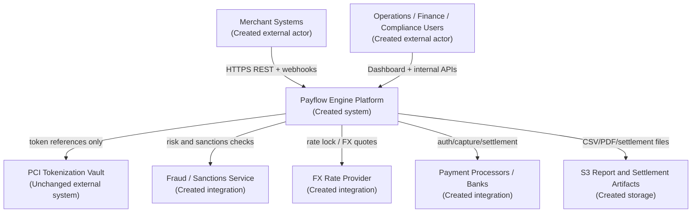
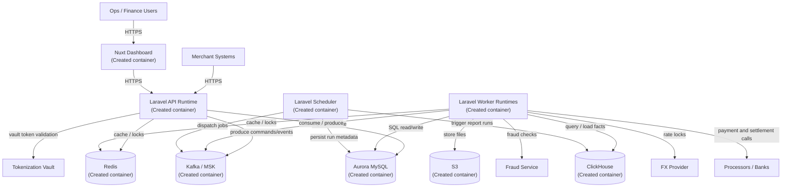
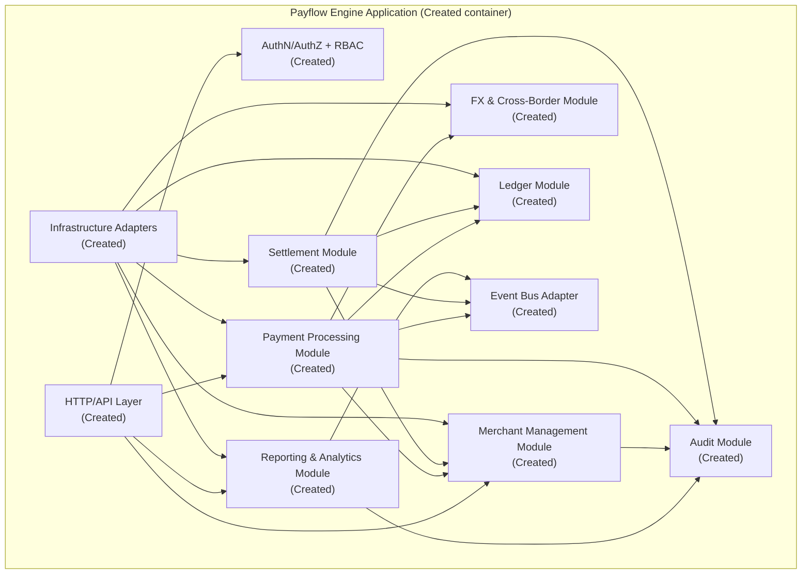

# Architecture: fintech transaction platform

**Status:** Proposed for review
**Scope:** Initial application draft derived from requirements and source design

---

## 1. Context Diagram

### Notes

- `Payflow Engine Platform` is a new application to be created in this repository.
- The external tokenization vault is unchanged and remains outside platform ownership.
- Payment processors, FX providers, and fraud providers are integration boundaries, not internal modules.

---

## 2. Container Diagram

### Container Responsibilities

| Container | Responsibility | Change Status |
|-----------|----------------|---------------|
| Nuxt Dashboard | Internal operations UI, reconciliation review, reporting access | Created |
| Laravel API Runtime | Merchant APIs, internal APIs, status queries, authn/authz, idempotent ingress | Created |
| Laravel Worker Runtimes | Payment commands, callbacks, settlement, reconciliation, analytics projection, webhooks | Created |
| Laravel Scheduler | Recurring windows, deadline handling, report schedules, housekeeping | Created |
| Aurora MySQL | OLTP source of truth | Created |
| Redis | Idempotency cache, locks, rate limiting, config cache | Created |
| Kafka | Durable command/event backbone | Created |
| ClickHouse | Analytical read store and materialized views | Created |
| S3 | Settlement files, exports, archived audit artifacts | Created |

---

## 3. Component Diagram: Laravel API + Workers

### Component Boundaries

| Component | Owns | Must Not Own | Change Status |
|-----------|------|--------------|---------------|
| HTTP/API Layer | Controllers, request validation, response mapping, correlation IDs | Business rules, direct table joins across modules | Created |
| AuthN/AuthZ + RBAC | API key auth, operator auth, role checks | Domain business workflows | Created |
| Merchant Management | Merchants, credentials, fee schedules, webhook endpoints | Payment state transitions | Created |
| Payment Processing | Ingestion, state machine, processor routing, callbacks | Ledger balancing rules, reporting projections | Created |
| FX & Cross-Border | Rate locks, conversions, markup tracking | Merchant access control, reporting UI | Created |
| Ledger | Journal rules, ledger entries, account definitions | Processor integration logic | Created |
| Settlement | Batches, file generation, reconciliation records | Initial authorization/capture logic | Created |
| Reporting & Analytics | Projections, report runs, exports, dashboard query models | Transactional writes in OLTP | Created |
| Audit | Immutable audit records, access logging | Domain state transitions themselves | Created |
| Event Bus Adapter | Kafka topics, producer/consumer mapping, retry envelopes | Domain decisions | Created |
| Infrastructure Adapters | Eloquent, repository impls, HTTP clients, S3, Redis, ClickHouse | Cross-module orchestration decisions | Created |

---

## 4. Deployment Notes

- Single codebase, multiple process groups.
- Monolith boundary is logical, not networked microservices.
- Scale API, payment workers, settlement workers, and analytics workers independently.
- Aurora remains the only transactional write source.
- ClickHouse is read-only from the application perspective except analytics projection writers.

---

## 5. Out of Scope

- Multi-region topology design
- Merchant self-serve portal design beyond internal operator UI
- Detailed AWS network diagrams
- Exact third-party provider selection
