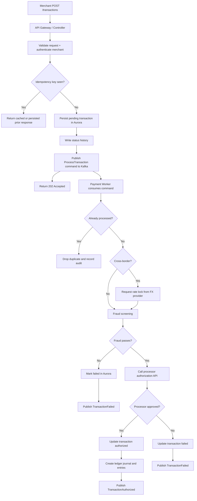
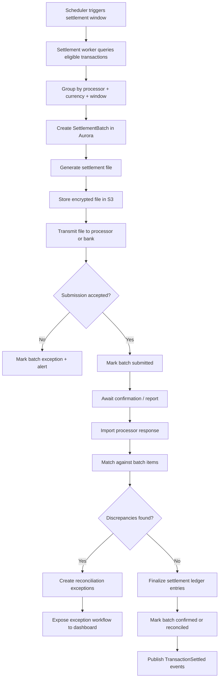
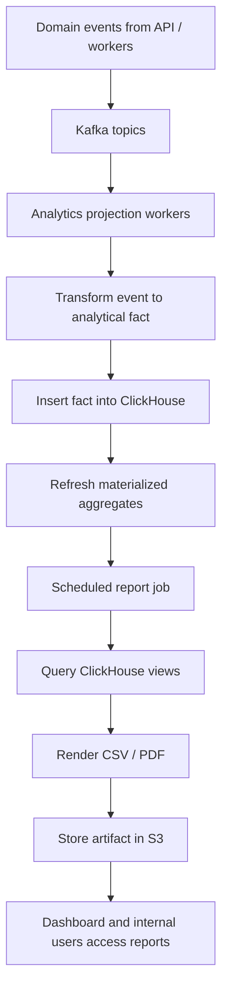

# Data Flow: fintech transaction platform

**Status:** Proposed for review

---

## 1. Primary Transaction Ingestion And Authorization

### Error Paths

- Validation failure returns `422` before any write.
- Authentication failure returns `401` or `403` before any write.
- Duplicate idempotency returns prior accepted result without re-running authorization.
- FX provider failure causes transaction failure or retry based on lock acquisition policy.
- Fraud rejection stops processor calls entirely.
- Processor timeout triggers retry or status inquiry flow before terminal failure.

---

## 2. Settlement And Reconciliation

### Error Paths

- Missing or malformed processor report moves the batch to `exception`.
- S3 write failure blocks submission and keeps batch non-submitted.
- Partial confirmation creates reconciliation exceptions instead of silent completion.
- Manual resolution writes explicit audit records and follow-up state transitions.

---

## 3. OLTP To OLAP Reporting Pipeline

### Error Paths

- Consumer lag beyond threshold delays report generation and triggers alerting.
- Projection failure dead-letters the event and keeps OLTP processing unaffected.
- Stale ClickHouse watermark causes report jobs to delay rather than generate incomplete output.

---

## 4. Cross-Cutting Data Handling Rules

| Data Type | Source of Truth | Transit | Derived Storage | Notes |
|-----------|-----------------|---------|-----------------|-------|
| Transactions | Aurora | HTTP, Kafka | ClickHouse facts | Writes only in OLTP |
| Ledger entries | Aurora | Kafka events | Reporting aggregates | Append-only |
| FX locks | Aurora | Worker/provider API | ClickHouse facts | Time-bounded |
| Reports | ClickHouse query output | Scheduler/worker | S3 | Export-only artifacts |
| Audit records | Aurora audit tables | Kafka optional | S3 archive | Immutable |
| Idempotency cache | Redis | API runtime | None | Ephemeral |

---

## 5. Security-Sensitive Flows

- Raw PAN never enters the platform.
- PII-bearing requests must be encrypted in transit and stored with field-level protection where required.
- Every operator-triggered manual action emits an audit event.
- Reconciliation imports are treated as untrusted input and must be validated before persistence.
