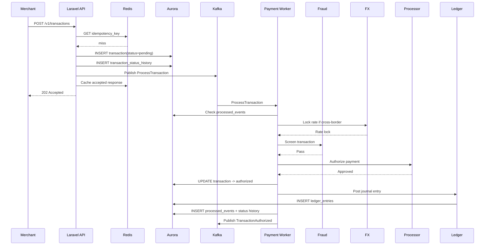
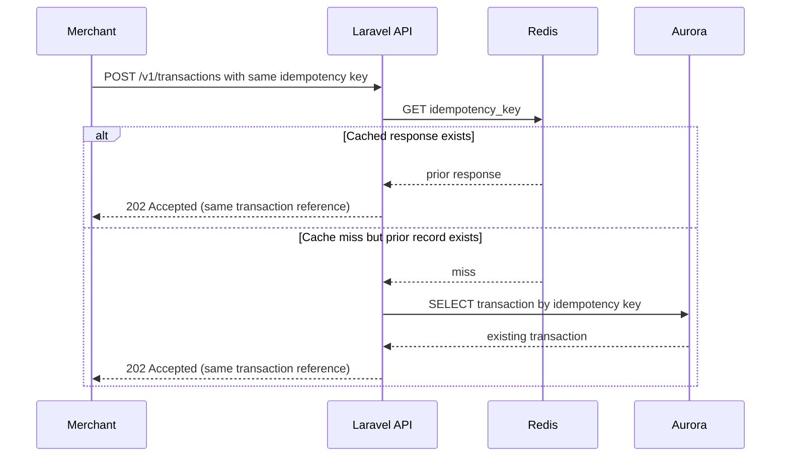
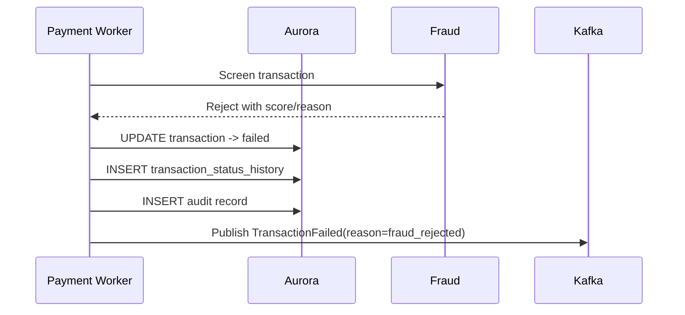
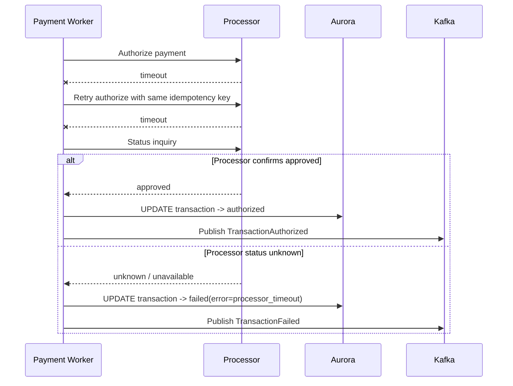
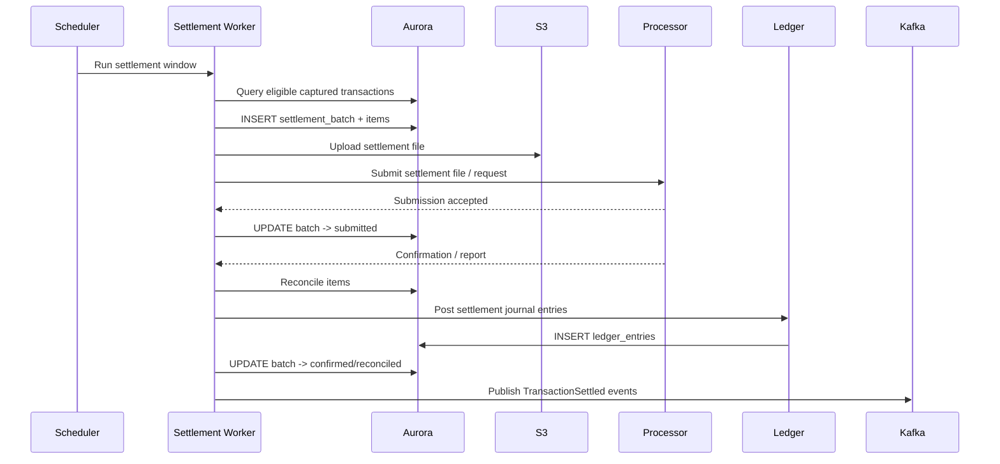
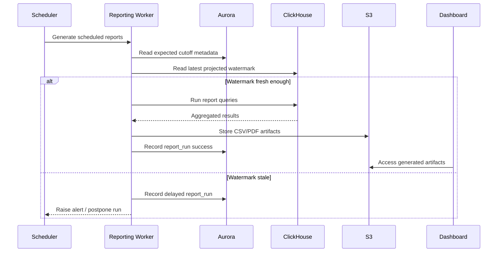

# Sequence Diagrams: fintech transaction platform

**Status:** Proposed for review

---

## 1. Primary Success Scenario: Transaction Ingestion To Authorization

---

## 2. Duplicate Request Scenario

---

## 3. Fraud Rejection Scenario

---

## 4. Processor Timeout With Status Inquiry

---

## 5. Settlement Success Scenario

---

## 6. Reporting Scenario With Staleness Check

